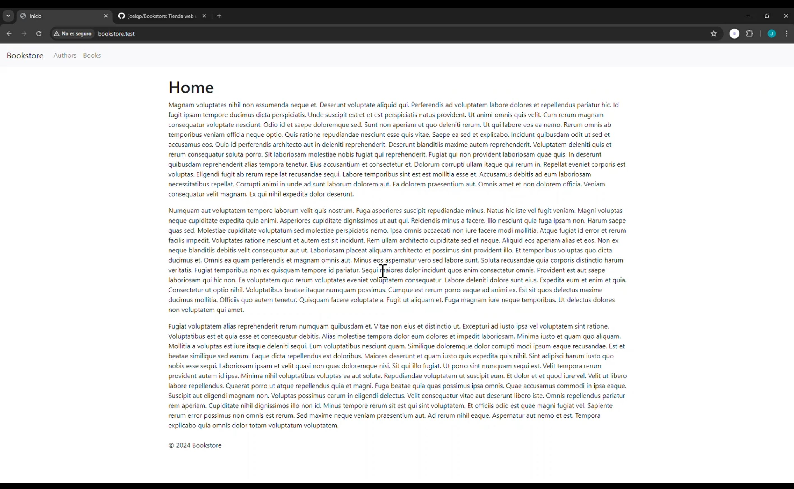
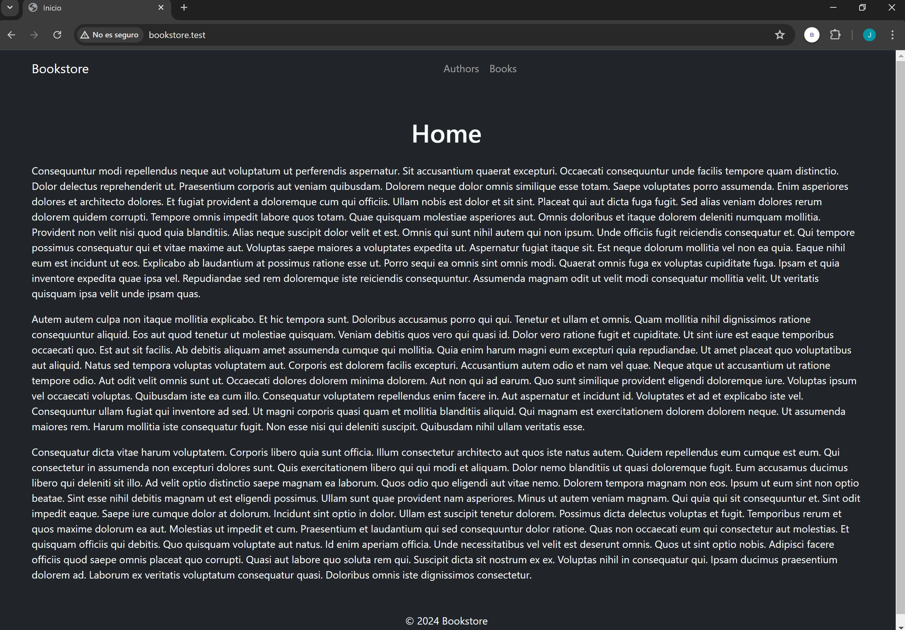

# BOOKSTORE

### Tienda de libros desarrollada con el stack tecnológico: Laravel, Bootstrap y MySQL.

---

### Algunas aclaraciones:
- Me decanté por no usar ningun kit de Laravel para mostrar más solidez en el aprendizaje de este framework.

- He decidido no hacer en cascada la relacion autores-libros para que, en el caso de eliminar un autor, los libros pertenecientes a él puedan cambiar a otro autor al seleccionar el boton de editar el libro.

- El proyecto, ademas de lo que se pide, incluye algunas implementaciones mas como ...


### Problemas encontrados:

- Al crear las factories, he tenido un poco de dificultad para entender las diferentes maneras de crearlas. 
Podria hacerlo de 2 maneras
    
    - a) todos los autores y libros estan vinculados entre si.

		- Podria llamar a factory()->create de book dentro del seeder de autors para que por cada autor creado, se vayan a crear libros vinculados a él
		- tambien podria tener el mismo resultado si llamo a factory()->create de autor dentro de la factory de books.
    - b) otro enfoque seria crear autores independientemente, y luego crear books y vicularlos a los autores existentes.

    Elegi la segunda porque asi habria mas independencia entre autores y libros y puedo tener mas control sobre el codigo.

- Al momento de crear la funcionalidad *Delete author* me surgió un error: 
```sql
SQLSTATE[23000]: Integrity constraint violation: 1451 Cannot delete or update a parent row: a foreign key constraint fails
(`bookstore`.`books`, CONSTRAINT `books_author_id_foreign` FOREIGN KEY (`author_id`) REFERENCES `authors` (`id`))
```

Inicialmente defini la clave foránea asi en la migracion de los libros:
`$table->foreignId('author_id')->nullOnDelete()->constrained();`
entendi que `constrained()` deberia ir siempre al final y nada más, pero el error estaba aqui.

Releyendo a profundidad la documentacion y mirando algun ejemplo en foros, entendi mas a profundidad como funcionan los metodos
y la importancia de su orden.

Entendi que `nullable()` o `constrained()` son *modificadores* y que indican propiedades de la columna, y hacer `nullondelete()` o `ondelete()` son acciones asociadas y no propiedades de la columna, por lo que deben llamarse despues de los metodos que indican propiedades.

por lo que la definicion correcta era:  `$table->foreignId('author_id')->nullable()->constrained()->nullOnDelete();`


Creo que tengo una comprension general buena, pero si en futuros proyectos me encuentro con situaciones con mas complejidad, puedo revisar a mas profundidad la documentacion y ponerlo en pratica.

---
## Resultados

### Video
https://youtu.be/r1KeJRFrBxo

### Imagenes

<center>
primera version
</center>



<center>
Version con un estilo oscuro
</center>




---

## Instrucciones sobre la instalación
### Versiones
- PHP: 8.2

- Laravel: 10.x

- Bootstrap: 5.3

### Configuración

Asegurate de tener el archivo *.env* igual que *.env.example* donde solo configures la conexión a tu base de datos:

```sh
DB_CONNECTION=mysql
DB_HOST=127.0.0.1
DB_PORT=3306
DB_DATABASE=nombre_de_tu_basedatos
DB_USERNAME=nombre_de_tu_usuario
DB_PASSWORD=contraseña_de_tu_base_de_datos
```

### Comandos para ejecutar

Para generar la clave del a aplicación.
```sh
php artisan key:generate
```

Para ejecutar las migraciones.
```sh
php artisan migrate
```
Para ejecutar los seeders (en ese orden).
```sh
php artisan db:seed --class=AuthorsTableSeeder
php artisan db:seed --class=BooksTableSeeder
```

Para acceder a la web de desarrollo a traves de la URL .`localhost:800`
```sh
php artisan serve
```
Tambien se puede acceder directamente a la web a traves de la URL `bookstore.test` si se ejecuta en un entorno Laragon.


